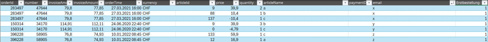
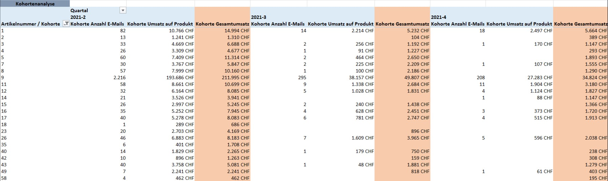
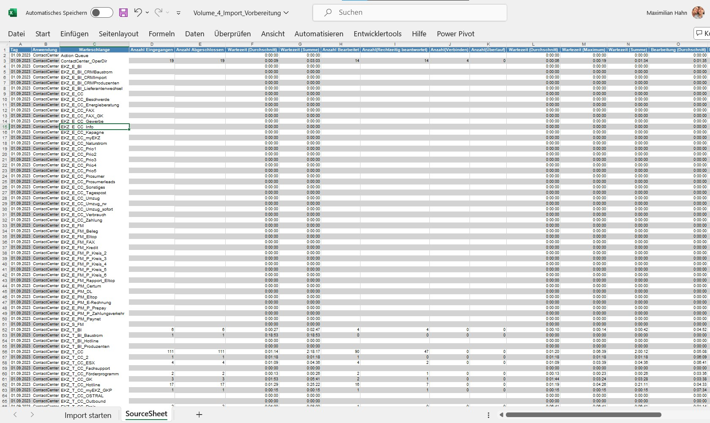

# Maximilian Hahn - Portfolioprojekte

## Projekt 1 bei Schweizer Nahrungsergänzungsmittel-Unternehmen: Kohortenanalyse in Excel Power Pivot mit DAX-Measure

### Beschreibung
Dieses Projekt umfasst die Entwicklung einer dynamischen Kohortenanalyse in Excel Power Pivot. Ziel ist es, den Umsatz einer Kundenkohorte zu berechnen, die im auswählbaren Startquartal gekauft hat, und deren Umsatzentwicklung über spätere Quartale hinweg zu verfolgen. Mithilfe von Slicern für Start- und Endquartal lässt sich der Analysezeitraum flexibel steuern, um Kundenbindung und Wiederkaufsverhalten gezielt auszuwerten.

### Verwendete Tabelle
`Bestellungen bis 2025 Q1`

**Relevante Spalten:**
- `E-Mail` (zur Kundenidentifikation)
- `Kaufquartal` (z. B. "2023 Q2")
- `number` (Eindeutige Bestellnummer)
- `Rechnungsbetrag` (Gesamter Bestellwert pro Kundenbestellung)

### DAX Measure
```dax
VAR StartQ =
    IF(
        HASONEVALUE( Startquartal[Startquartal] );
        VALUES( Startquartal[Startquartal] )
    )
VAR EndQ =
    IF(
        HASONEVALUE( Endquartal[Endquartal] );
        VALUES( Endquartal[Endquartal] )
    )
VAR AktQ =
    MAX( 'Bestellungen bis 2025 Q1'[Kaufquartal] )
VAR InitialCustomers =
    CALCULATETABLE(
        DISTINCT( 'Bestellungen bis 2025 Q1'[E-Mail] );
        'Bestellungen bis 2025 Q1'[Kaufquartal] = StartQ
    )
VAR InRange = AktQ >= StartQ && AktQ <= EndQ

RETURN
IF(
    InRange;
    VAR Base =
        FILTER(
            ALL( 'Bestellungen bis 2025 Q1' );
            'Bestellungen bis 2025 Q1'[Kaufquartal] = AktQ
            && 'Bestellungen bis 2025 Q1'[E-Mail] IN InitialCustomers
        )
    VAR OrdersDistinct =
        SUMMARIZE(
            Base;
            'Bestellungen bis 2025 Q1'[number];
            "TotalAmount"; MAX( 'Bestellungen bis 2025 Q1'[Rechnungsbetrag] )
        )
    RETURN
        SUMX( OrdersDistinct; [TotalAmount] )
)
```

---

### Start- & Endquartal bestimmen
```dax
VAR StartQ =
    IF(
        HASONEVALUE( Startquartal[Startquartal] );
        VALUES( Startquartal[Startquartal] )
    )
VAR EndQ =
    IF(
        HASONEVALUE( Endquartal[Endquartal] );
        VALUES( Endquartal[Endquartal] )
    )
```
Die Quartale werden im Arbeitsblatt über Slicer vom Nutzer ausgewählt. Diese Werte werden in den Variablen StartQ sowie EndQ gespeichert

### Aktuelles Quartal ermitteln
```dax
VAR AktQ = MAX('Bestellungen bis 2025 Q1'[Kaufquartal])
```
Nimmt das Quartal im aktuellen Filterkontext, welcher hier aus dem Start- und Endquartal sowie der in der sich in der Matrix-Zeile befindlichen Artikelnummer zusammensetzt

### Kohorte bestimmen
```dax
VAR InitialCustomers =
       CALCULATETABLE(
           DISTINCT('Bestellungen bis 2025 Q1'[E-Mail]),
           'Bestellungen bis 2025 Q1'[Kaufquartal] = StartQ
       )
```
Bestimmt die eindeutigen E-Mail Adressen aller Kunden, die im Startquartal gekauft haben.

### Befindet sich das aktuelles Quartal innerhalb des Zeitrahmens?
```dax
VAR InRange = AktQ >= StartQ && AktQ <= EndQ
```
An dieser Stelle soll lediglich der vom Nutzer über die Slicer ausgewählte Zeitraum beachtet werden

### Filterung auf relevante Zeilen
```dax
VAR Base =
       FILTER(
           ALL('Bestellungen bis 2025 Q1'),
           'Bestellungen bis 2025 Q1'[Kaufquartal] = AktQ &&
           'Bestellungen bis 2025 Q1'[E-Mail] IN InitialCustomers
       )
```
Hier werden zunächst alle anderen Filter aufgehoben. Im Anschluss wird die Bestelltabelle jedoch nach dem im aktuellen Filterkontext sichtbaren Quartal und den E-Mail-Adressen der Kohorte gefiltert.

### Aggregation auf Bestellnummer-Ebene
```dax
VAR OrdersDistinct =
       SUMMARIZE(
           Base,
           [number],
           "TotalAmount", MAX([Rechnungsbetrag])
       )
```
An dieser Stelle muss das Format der aus der Shopware-Datenbank des Unternehmens exportierten Daten beachtet werden. Diese liegen in folgender Form vor:



Jede Kundenbestellung weist hier je Produkt eine Zeile vor. Dies bedeutet, dass der finale Rechnungsbetrag (Spalte "invoiceAmount") mehrfach vorkommt. 
Dieser Teil des Measures sorgt somit dafür, dass pro Bestellung nach der eindeutigen Nummer in der Spalte "number" aggregiert wird und jeweils nur ein einzelner Rechnungsbetrag der Spalte "invoiceAmount" in Betracht gezogen wird.

### Umsatz summieren
```dax
SUMX( OrdersDistinct, [TotalAmount] )
```
Final werden dann die Bestellwerte aller eindeutigen Kundenbestellungen aufsummiert.

### Visualisierung



Dies ist das Visuelle Ergebnis der Auswertung mit fiktiven Zahlen in der orange-markierten Spalte dargestellt. Neben diesem Kohorten-Gesamtumsatz hatte ich zudem den Auftrag den Umsatz nur auf den 
Artikel im aktuellen Filterkontext sowie die Anzahl der Kunden zu ermitteln. Diese sind in den beiden linken Spalten zu sehen.

---

## Projekt 2 in Schweizer Telekommunikationsunternehmen: Berechnung des Bradford-Faktors zur Mitarbeiterabwesenheit

### Beschreibung
Dieses Projekt beinhaltet die Berechnung des Bradford-Faktors für Mitarbeiter basierend auf ihren Abwesenheitsdaten. Es war Teil einer größeren Analyse bezüglich der Absenz von Mitarbeitern, welche nach Einführung des Geschäftsanalyse-Dienst Power BI dem Management als Report zur Verfügung gestellt werden sollte. Der Bradford-Faktor ist eine Kennzahl, die die Anzahl und Dauer der Krankheitsausfälle von Mitarbeitern bewertet. Diese Metrik hilft dabei, die Auswirkungen von häufigen, kurzen Abwesenheiten zu analysieren, die sich stärker auf den Betrieb auswirken können als längere, seltenere Ausfälle.

Zwei Datumsvariablen @Von und @Bis definieren den Zeitraum, in dem die Analyse durchgeführt wird. Die Variablen @i und @j werden später in der Schleife verwendet.

```sql
DECLARE @Von DATE = '2024-02-01'
DECLARE @Bis DATE = '2024-02-29'
DECLARE @i INT
DECLARE @j DATE
```

Drei temporäre Tabellen werden erstellt, um die Zwischenergebnisse und die Endergebnisse zu speichern:

```sql
CREATE TABLE #Result_Periode (st_staff INT, Datum DATETIME, Zähler INT, Krank INT)
CREATE TABLE #Schichtcenter_Daten (Eintraege_total INT, Eintraege_MA INT, Datum DATETIME, st_staff_id INT, Krank INT)
CREATE TABLE #Bradford_Ergebnisse (st_staff_id INT, Anzahl_Ausfaelle INT, Anzahl_Fehltage INT)
```

#Result_Periode speichert die Periode der Abwesenheit jedes Mitarbeiters.
#Schichtcenter_Daten speichert die Schichtdaten der Mitarbeiter.
#Bradford_Ergebnisse speichert die endgültigen Bradford-Faktoren.

Hier werden die relevanten Schichtdaten von unserer unternehmensinternen Schichtplanungsdatenbank in die temporäre Tabelle #Schichtcenter_Daten eingefügt. Die Daten werden nach Mitarbeiter und Datum gruppiert und sortiert. Jede Zeile erhält eine laufende Nummer.

```sql
INSERT INTO #Schichtcenter_Daten
SELECT ROW_NUMBER() OVER (ORDER BY tws.st_staff_id),
       ROW_NUMBER() OVER (PARTITION BY tws.st_staff_id ORDER BY tws.on_date, tws.st_staff_id),
       tws.on_date,
       tws.st_staff_id,
       SUM(CASE WHEN tkt.name NOT LIKE '%Schichtfrei%' THEN 1 ELSE 0 END) OVER (PARTITION BY tws.st_staff_id) AS Anzahl_Krank
FROM [c1db3001].[isps_iewfm].[isps].tw_schedule tws
JOIN [c1db3001].[isps_iewfm].[isps].tk_type tkt ON tkt.tk_type_id = tws.ref_id
WHERE tws.on_date BETWEEN @Von AND @Bis
AND tws.layer = -1 
AND tws.version_id = 1000 
AND tws.level_id = 3000
AND tkt.class = 2 AND tkt.name NOT like '%Unfall%' AND tkt.is_deleted = 0
GROUP BY tws.on_date, tws.st_staff_id, tkt.name
ORDER BY tws.on_date, tws.st_staff_id
```

Initialisierung der Schleifenvariablen @i auf den Wert 1, um die Schleife zu starten.

```sql
SET @i = 1
```

Diese Schleife iteriert durch die Einträge in #Schichtcenter_Daten. Wenn es sich um den ersten Eintrag eines Mitarbeiters oder um ein nicht aufeinanderfolgendes Datum handelt, wird ein neuer Eintrag in #Result_Periode erstellt. Die Variable @j wird aktualisiert, um das Datum des aktuellen Eintrags zu speichern.

```sql
WHILE @i <= (SELECT MAX(Eintraege_total) FROM #Schichtcenter_Daten)
BEGIN
    IF ((SELECT Eintraege_MA FROM #Schichtcenter_Daten WHERE Eintraege_total = @i) = 1 
        OR (SELECT Datum FROM #Schichtcenter_Daten WHERE Eintraege_total = @i) <> DATEADD(DAY,1,@j)) 
        INSERT INTO #Result_Periode
            SELECT st_staff_id, Datum, 1, Krank FROM #Schichtcenter_Daten WHERE Eintraege_total = @i
    SET @j = (SELECT Datum FROM #Schichtcenter_Daten WHERE Eintraege_total = @i)
    SET @i = @i + 1
END
```

Die endgültigen Bradford-Faktoren werden berechnet und in die Tabelle #Bradford_Ergebnisse eingefügt. Die Anzahl der Ausfallperioden und die durchschnittliche Anzahl der Krankheitstage werden pro Mitarbeiter gruppiert und berechnet.

```sql
INSERT INTO #Bradford_Ergebnisse
SELECT RP.st_staff, SUM(RP.zähler) AS Anzahl_Periode, AVG(RP.Krank) AS Anzahl_Tage 
FROM #Result_Periode RP 
GROUP BY RP.st_staff
```

Im Folgenden findet die Ausgabe der Ergebnisse und das Löschen der temporären Tabellen statt, um den Speicherplatz freizugeben.

```sql
SELECT * FROM #Bradford_Ergebnisse
DROP TABLE #Bradford_Ergebnisse, #Result_Periode, #Schichtcenter_Daten
```

### Fiktive Ergebnistabelle

Diese Tabelle zeigt die Anzahl der Ausfälle und die durchschnittliche Anzahl der Fehltage für verschiedene Mitarbeiter.

| Mitarbeiter-ID | Anzahl Ausfälle | Durchschnittliche Fehltage |
|----------------|------------------|----------------------------|
| 101            | 3                | 2                          |
| 102            | 1                | 5                          |
| 103            | 2                | 3                          |
| 104            | 4                | 1.5                        |
| 105            | 2                | 4                          |

Sie enthält hierbei folgende drei Spalten:

- **Mitarbeiter-ID**: Die eindeutige ID des Mitarbeiters.
- **Anzahl Ausfälle**: Die Anzahl der Abwesenheitsperioden des Mitarbeiters innerhalb des angegebenen Zeitraums.
- **Durchschnittliche Fehltage**: Die durchschnittliche Anzahl der Fehltage pro Abwesenheitsperiode.

Zusammengefasst berechnet dieser Code Bradford-Faktoren für Mitarbeiter basierend auf Schichtdaten in einem bestimmten Zeitraum und speichert die Ergebnisse in temporären Tabellen, bevor sie schließlich ausgegeben werden.

---

## Projekt 3 in Schweizer Telekommunikationsunternehmen: Datenbereinigung und -verarbeitung mit VBA

Dieser VBA-Code ist ein Beispiel für die Datenbereinigung und -verarbeitung in Excel. Es handelte sich hierbei um einen Auftrag unseres Kunden Enersuisse, welche die Anrufdaten seiner Mitarbeiter täglich in einer Excel Datei zur Verfügung stellt. Das Ziel des Projekts war es die Excel-Datei in ein für den Kunden passendes Format zu bringen und anschließend zur besseren Analyse mithilfe von SQL Server Integration Services (SSIS) in eine SQL-Datenbank zu importieren. 

Der VBA-Code trennt dabei verbundene Zellen, organisiert die Daten neu und löscht überflüssige Spalten, um das Arbeitsblatt zu bereinigen und die Daten für weitere Analysen vorzubereiten.


Aktivieren des Arbeitsblattes:

```vba
ThisWorkbook.Activate
Set SourceSheet = ActiveWorkbook.Worksheets("SourceSheet")
```

Aktiviert das aktuelle Workbook und weist das Arbeitsblatt "SourceSheet" der Variablen SourceSheet zu.
Bildschirmaktualisierung wird deaktiviert, um die Ausführungsgeschwindigkeit zu erhöhen und Bildschirmflackern zu vermeiden.

```vba
Application.ScreenUpdating = False
```

Zelleverbund wird aufgehoben:

```vba
SourceSheet.Cells(1, 3).Select
Selection.UnMerge
SourceSheet.Cells(2, 3).Select
Selection.UnMerge
```

Auftrennen der verbundenen Zellen in den ersten beiden Zeilen der Spalte C und ermitteln der relevanten Zeilen:

```vba
FirstRow = 3
LastRow = SourceSheet.Cells(Rows.Count, 1).End(xlUp).Row
Bestimmt die erste relevante Zeile (FirstRow = 3) und die letzte gefüllte Zeile in der Spalte A (LastRow).
```

Anschließendes Durchlaufen der Zeilen von FirstRow bis LastRow, Trennung der verbundenen Zellen und Verschiebung der Inhalte entsprechend in die Spalten A, B und C.

```vba
For SourceRow = FirstRow To LastRow
    SourceSheet.Cells(SourceRow, 1).Select
    If Trim(SourceSheet.Cells(SourceRow, 1).Value) <> "" And Selection.Cells.Count = 1 Then
        SpaltenArray(0) = SourceSheet.Cells(SourceRow, 1).Value
    ElseIf Trim(SourceSheet.Cells(SourceRow, 1).Value) <> "" And Selection.Cells.Count = 2 Then
        Selection.UnMerge
        SpaltenArray(1) = SourceSheet.Cells(SourceRow, 1).Value
        SourceSheet.Cells(SourceRow, 1).Value = SpaltenArray(0)
        SourceSheet.Cells(SourceRow, 2).Value = SpaltenArray(1)
    Else
        SourceSheet.Cells(SourceRow, 2).Select
        Selection.UnMerge
        SourceSheet.Cells(SourceRow, 1).Value = SpaltenArray(0)
        SourceSheet.Cells(SourceRow, 3).Value = SourceSheet.Cells(SourceRow, 2).Value
        SourceSheet.Cells(SourceRow, 2).Value = SpaltenArray(1)
    End If
    SourceSheet.Cells(SourceRow, 3).Select
    If Selection.Cells.Count = 2 Then
        Selection.UnMerge
    End If
Next SourceRow
```

Löschung der Spalte D und Verschiebung der restlichen Spalten nach links.

```vba
Columns("D:D").Select
Selection.Delete Shift:=xlToLeft
```

Aktivierung der Bildschirmaktualisierung nachdem die Datenbereinigung abgeschlossen ist.

```vba
Application.ScreenUpdating = True
```

Die transformierten Daten für den Import per SSIS sehen anschließend aus:


