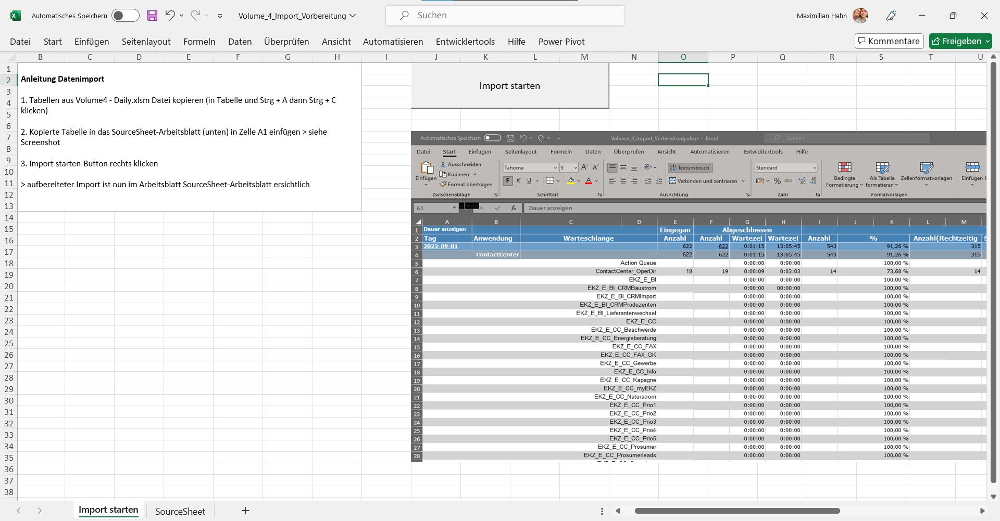

# Business-Consulting Projekte
Dies ist ein Repository, welches Projekte während meiner Anstellung als Business Consultant bei der Capita Customer Services AG enthält.
Ts

## Inhaltsverzeichnis

- [Projekt: Berechnung des Bradford-Faktors zur Mitarbeiterabwesenheit](#Projekt: Berechnung des Bradford-Faktors zur Mitarbeiterabwesenheit)
- [Projekt: Datenbereinigung und -verarbeitung mit VBA](#Projekt: Datenbereinigung und -verarbeitung mit VBA)


## Projekt: Berechnung des Bradford-Faktors zur Mitarbeiterabwesenheit

### Beschreibung
Dieses Projekt beinhaltet die Berechnung des Bradford-Faktors für Mitarbeiter basierend auf ihren Abwesenheitsdaten. Der Bradford-Faktor ist eine Kennzahl, die die Anzahl und Dauer der Krankheitsausfälle von Mitarbeitern bewertet. Diese Metrik hilft dabei, die Auswirkungen von häufigen, kurzen Abwesenheiten zu analysieren, die sich stärker auf den Betrieb auswirken können als längere, seltenere Ausfälle.

Zwei Datumsvariablen @Von und @Bis definieren den Zeitraum, in dem die Analyse durchgeführt wird. Die Variablen @i und @j werden später in der Schleife verwendet.

```sql
DECLARE @Von DATE = '2024-02-01'
DECLARE @Bis DATE = '2024-02-29'
DECLARE @i INT
DECLARE @j DATE
```

Drei temporäre Tabellen werden erstellt, um die Zwischenergebnisse und die Endergebnisse zu speichern:

```sql
CREATE TABLE #Result_Periode (st_staff INT, Datum DATETIME, Zähler INT, Krank INT)
CREATE TABLE #Schichtcenter_Daten (Eintraege_total INT, Eintraege_MA INT, Datum DATETIME, st_staff_id INT, Krank INT)
CREATE TABLE #Bradford_Ergebnisse (st_staff_id INT, Anzahl_Ausfaelle INT, Anzahl_Fehltage INT)
```

#Result_Periode speichert die Periode der Abwesenheit jedes Mitarbeiters.
#Schichtcenter_Daten speichert die Schichtdaten der Mitarbeiter.
#Bradford_Ergebnisse speichert die endgültigen Bradford-Faktoren.

Hier werden die relevanten Schichtdaten von unserer unternehmensinternen Schichtplanungsdatenbank in die temporäre Tabelle #Schichtcenter_Daten eingefügt. Die Daten werden nach Mitarbeiter und Datum gruppiert und sortiert. Jede Zeile erhält eine laufende Nummer.

```sql
INSERT INTO #Schichtcenter_Daten
SELECT ROW_NUMBER() OVER (ORDER BY tws.st_staff_id),
       ROW_NUMBER() OVER (PARTITION BY tws.st_staff_id ORDER BY tws.on_date, tws.st_staff_id),
       tws.on_date,
       tws.st_staff_id,
       SUM(CASE WHEN tkt.name NOT LIKE '%Schichtfrei%' THEN 1 ELSE 0 END) OVER (PARTITION BY tws.st_staff_id) AS Anzahl_Krank
FROM [c1db3001].[isps_iewfm].[isps].tw_schedule tws
JOIN [c1db3001].[isps_iewfm].[isps].tk_type tkt ON tkt.tk_type_id = tws.ref_id
WHERE tws.on_date BETWEEN @Von AND @Bis
AND tws.layer = -1 
AND tws.version_id = 1000 
AND tws.level_id = 3000
AND tkt.class = 2 AND tkt.name NOT like '%Unfall%' AND tkt.is_deleted = 0
GROUP BY tws.on_date, tws.st_staff_id, tkt.name
ORDER BY tws.on_date, tws.st_staff_id
```

Initialisierung der Schleifenvariablen @i auf den Wert 1, um die Schleife zu starten.

```sql
SET @i = 1
```

Diese Schleife iteriert durch die Einträge in #Schichtcenter_Daten. Wenn es sich um den ersten Eintrag eines Mitarbeiters oder um ein nicht aufeinanderfolgendes Datum handelt, wird ein neuer Eintrag in #Result_Periode erstellt. Die Variable @j wird aktualisiert, um das Datum des aktuellen Eintrags zu speichern.

```sql
WHILE @i <= (SELECT MAX(Eintraege_total) FROM #Schichtcenter_Daten)
BEGIN
    IF ((SELECT Eintraege_MA FROM #Schichtcenter_Daten WHERE Eintraege_total = @i) = 1 
        OR (SELECT Datum FROM #Schichtcenter_Daten WHERE Eintraege_total = @i) <> DATEADD(DAY,1,@j)) 
        INSERT INTO #Result_Periode
            SELECT st_staff_id, Datum, 1, Krank FROM #Schichtcenter_Daten WHERE Eintraege_total = @i
    SET @j = (SELECT Datum FROM #Schichtcenter_Daten WHERE Eintraege_total = @i)
    SET @i = @i + 1
END
```

Die endgültigen Bradford-Faktoren werden berechnet und in die Tabelle #Bradford_Ergebnisse eingefügt. Die Anzahl der Ausfallperioden und die durchschnittliche Anzahl der Krankheitstage werden pro Mitarbeiter gruppiert und berechnet.

```sql
INSERT INTO #Bradford_Ergebnisse
SELECT RP.st_staff, SUM(RP.zähler) AS Anzahl_Periode, AVG(RP.Krank) AS Anzahl_Tage 
FROM #Result_Periode RP 
GROUP BY RP.st_staff
```

Ausgabe der Ergebnisse und löschen der temporären Tabellen, um den Speicherplatz freizugeben.

```sql
SELECT * FROM #Bradford_Ergebnisse
DROP TABLE #Bradford_Ergebnisse, #Result_Periode, #Schichtcenter_Daten
```

## Fiktive Ergebnistabelle

Diese Tabelle zeigt die Anzahl der Ausfälle und die durchschnittliche Anzahl der Fehltage für verschiedene Mitarbeiter basierend auf den Ergebnissen des SQL-Codes.

| Mitarbeiter-ID | Anzahl Ausfälle | Durchschnittliche Fehltage |
|----------------|------------------|----------------------------|
| 101            | 3                | 2                          |
| 102            | 1                | 5                          |
| 103            | 2                | 3                          |
| 104            | 4                | 1.5                        |
| 105            | 2                | 4                          |

Sie enthält hierbei folgende drei Spalten:

- **Mitarbeiter-ID**: Die eindeutige ID des Mitarbeiters.
- **Anzahl Ausfälle**: Die Anzahl der Abwesenheitsperioden des Mitarbeiters innerhalb des angegebenen Zeitraums.
- **Durchschnittliche Fehltage**: Die durchschnittliche Anzahl der Fehltage pro Abwesenheitsperiode.

Zusammengefasst, berechnet dieser Code Bradford-Faktoren für Mitarbeiter, basierend auf Schichtdaten in einem bestimmten Zeitraum, und speichert die Ergebnisse in temporären Tabellen, bevor sie schließlich ausgegeben werden.


## Projekt: Datenbereinigung und -verarbeitung mit VBA

Dieser VBA-Code ist ein Beispiel für die Datenbereinigung und -verarbeitung in Excel. Er trennt verbundene Zellen, organisiert die Daten neu und löscht überflüssige Spalten, um das Arbeitsblatt zu bereinigen und die Daten für weitere Analysen vorzubereiten.



Aktivieren des Arbeitsblattes:

```vba
ThisWorkbook.Activate
Set SourceSheet = ActiveWorkbook.Worksheets("SourceSheet")
```

Aktiviert das aktuelle Workbook und weist das Arbeitsblatt "SourceSheet" der Variablen SourceSheet zu.
Bildschirmaktualisierung deaktivieren, um die Ausführungsgeschwindigkeit zu erhöhen und Flackern zu vermeiden.

```vba
Application.ScreenUpdating = False
```

Zelleverbund aufheben:

```vba
SourceSheet.Cells(1, 3).Select
Selection.UnMerge
SourceSheet.Cells(2, 3).Select
Selection.UnMerge
```

Trennt die verbundenen Zellen in den ersten beiden Zeilen der Spalte C.
Relevante Zeilen ermitteln:

```vba
FirstRow = 3
LastRow = SourceSheet.Cells(Rows.Count, 1).End(xlUp).Row
Bestimmt die erste relevante Zeile (FirstRow = 3) und die letzte gefüllte Zeile in der Spalte A (LastRow).
```

Durchläuft die Zeilen von FirstRow bis LastRow, trennt verbundene Zellen und verschiebt Inhalte entsprechend in die Spalten A, B und C.

```vba
For SourceRow = FirstRow To LastRow
    SourceSheet.Cells(SourceRow, 1).Select
    If Trim(SourceSheet.Cells(SourceRow, 1).Value) <> "" And Selection.Cells.Count = 1 Then
        SpaltenArray(0) = SourceSheet.Cells(SourceRow, 1).Value
    ElseIf Trim(SourceSheet.Cells(SourceRow, 1).Value) <> "" And Selection.Cells.Count = 2 Then
        Selection.UnMerge
        SpaltenArray(1) = SourceSheet.Cells(SourceRow, 1).Value
        SourceSheet.Cells(SourceRow, 1).Value = SpaltenArray(0)
        SourceSheet.Cells(SourceRow, 2).Value = SpaltenArray(1)
    Else
        SourceSheet.Cells(SourceRow, 2).Select
        Selection.UnMerge
        SourceSheet.Cells(SourceRow, 1).Value = SpaltenArray(0)
        SourceSheet.Cells(SourceRow, 3).Value = SourceSheet.Cells(SourceRow, 2).Value
        SourceSheet.Cells(SourceRow, 2).Value = SpaltenArray(1)
    End If
    SourceSheet.Cells(SourceRow, 3).Select
    If Selection.Cells.Count = 2 Then
        Selection.UnMerge
    End If
Next SourceRow
```

Löscht die gesamte Spalte D und verschiebt die restlichen Spalten nach links.

```vba
Columns("D:D").Select
Selection.Delete Shift:=xlToLeft
```

Aktiviert die Bildschirmaktualisierung erneut, nachdem die Datenbereinigung abgeschlossen ist.

```vba
Application.ScreenUpdating = True
```
